# Amber Ledger

Hi everyone! I made **Amber Ledger** — an offline **task manager + personal finance tracker for
Android** (iOS may come later). No account, no cloud, no ads: everything stays on your phone.

## ⬇️ Download

**[Download Amber-Ledger.apk](https://github.com/sakurasso12/Amber-ledger/releases/latest/download/Amber-Ledger.apk)**

Open the file on your phone and allow installing from this source when Android asks. Updates
install over the previous version and keep your data. I publish a new APK in
[Releases](https://github.com/sakurasso12/Amber-ledger/releases) every time there's a fix, even a
small one.

## 📱 Screens

### Tasks
Add any task you want: deadline with a reminder, priority, tags, subtasks, repeat rules and a
photo. Swipe a task to complete or delete it, hold to select several at once.

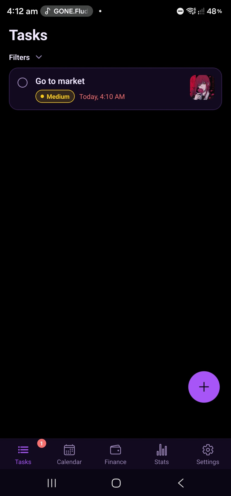

### Calendar
Your month at a glance — days with tasks and expenses are marked; tap a day to see everything on it.

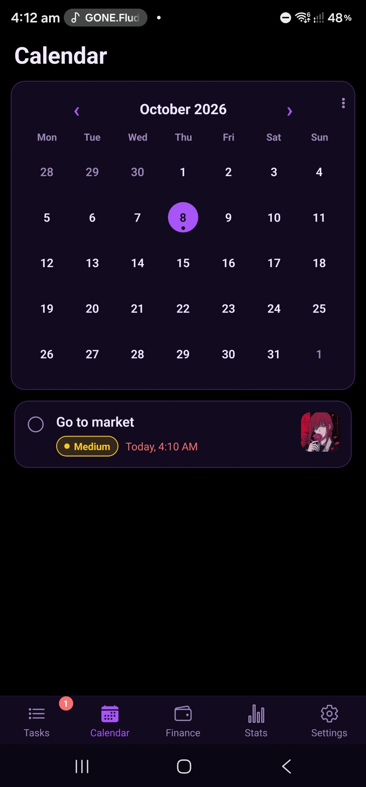

### Finance
Bank balance, salary that's still on its way, a calendar of your work shifts with earnings,
planned and recurring expenses, categories and budgets. The app asks on payday whether your
salary has actually arrived before it counts it.

| Finance | New expense |
|:---:|:---:|
| 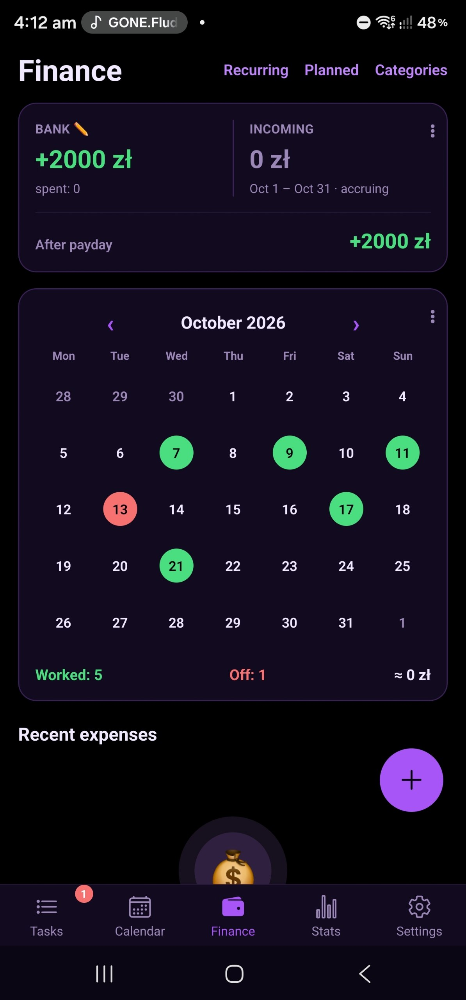 | 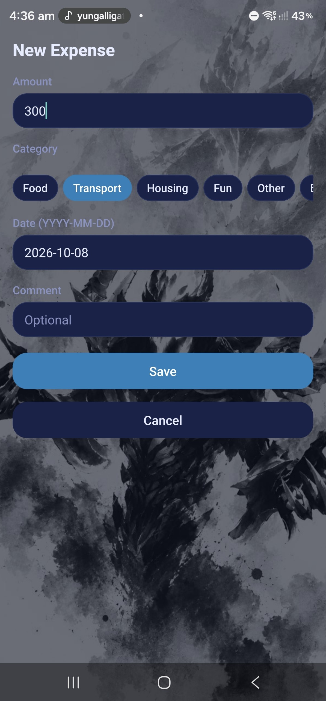 |

### Stats
Tasks created, completed and overdue per week; earnings per week and spending by category.

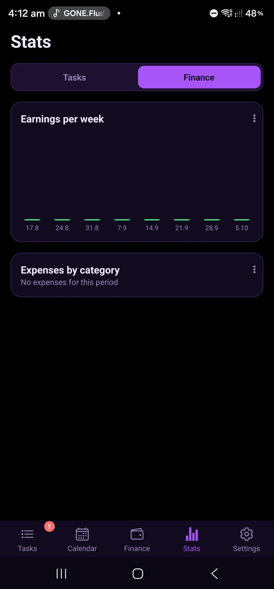

## ✨ Features

### 🔔 Notifications
Reminders before deadlines, a pinned notification for important tasks, budget alerts and a
payday reminder.

### 🎨 Almost everything is customizable
Everything about the look can be changed — except the font (coming soon):

- **Two layouts:** Standard, or Vertical — titles spelled down a rail on the left, the nearest
  task as a big *In focus* card with its photo as the background, a pill tab bar
- **Theme styles:** Amber, Neon, Paper — plus **light / dark / system** mode and an **accent colour**
- **Backgrounds:** your own picture behind the whole app, and a separate picture for any card
  (calendar, balance, charts…)
- **Home screen widgets:** today's tasks and spending, next task, next day off — each with its
  own background
- **Language:** English, Russian, Ukrainian
- Smooth, spring-based animations everywhere

| Standard | Vertical | Themes | Widgets |
|:---:|:---:|:---:|:---:|
|  | 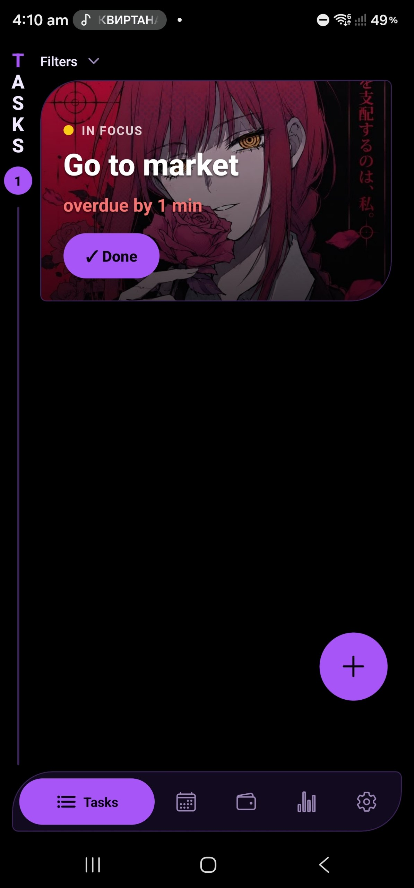 | 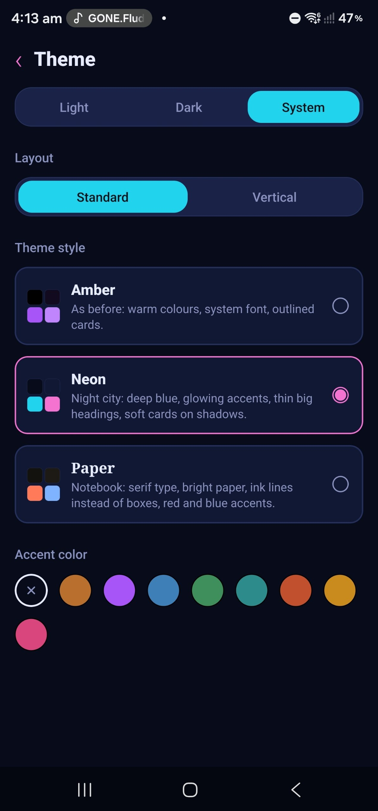 | 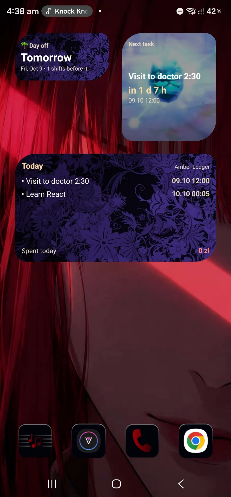 |

### 🔒 Security
Your money is nobody else's business. Turn on **Finance lock** in *Settings → Security* and every
amount — Finance, Stats, Calendar and the widget — stays blurred until you unlock it with:

- **fingerprint** (face unlock works too on phones that support it, e.g. Samsung),
- your **phone's PIN / pattern**,
- or your **profile password**.

It locks again after the time you choose (0–30 minutes after unlocking; 0 = as soon as you leave
Finance). The profile password is never stored — only a salted hash kept in Android's encrypted
Keystore.

| Locked | Security settings | Profile |
|:---:|:---:|:---:|
| 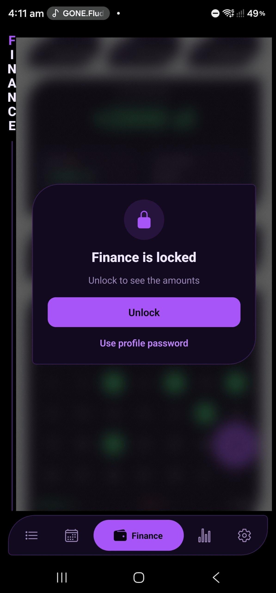 | 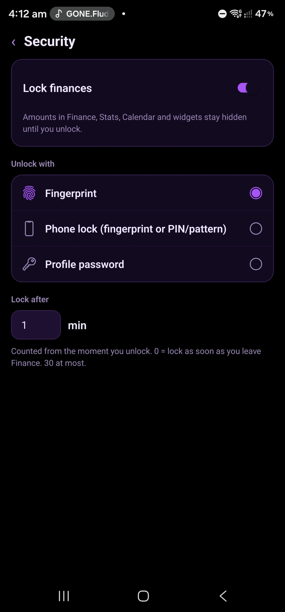 | 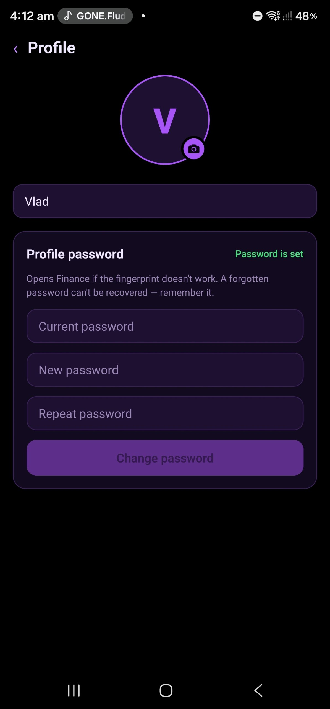 |

## 🛠️ How it's built

- **React Native + Expo** (SDK 57), **TypeScript**, routing with **expo-router**
- **SQLite** (expo-sqlite) for storage, **zustand** for state
- Own UI kit, charts and calendar (react-native-svg) — no UI or chart libraries
- APKs are built with **EAS Build**

The idea, the design, every feature and every change to the interface are my own initiative —
and I tested all of it on a real phone. I'm a beginner developer and a student, so I can't know
everything yet: **Claude (Anthropic's AI assistant)** was my mentor and pair programmer. It
explained what I didn't know and helped me keep the project moving while I was at work.

## 🚀 Run it yourself

**Just want to use it?** Download the [APK](#️-download) — that's all.

**Want to run the code?**

1. Install [Node.js](https://nodejs.org) (LTS) and [Git](https://git-scm.com).
2. Clone and install the dependencies:
   ```sh
   git clone https://github.com/sakurasso12/Amber-ledger.git
   cd Amber-ledger
   npm install
   ```
3. Start the dev server and scan the QR code with **Expo Go** on your phone (same Wi-Fi):
   ```sh
   npx expo start
   ```
   Expo Go can't run home screen widgets, notifications or the pinned notification — everything
   else works. For those, make your own build (below).

**Want to build your own APK?**

1. Create a free account at [expo.dev](https://expo.dev).
2. Install the EAS CLI and log in:
   ```sh
   npm install -g eas-cli
   eas login
   ```
3. Link the project to **your** account. It's linked to mine by default, so first delete
   `"owner"` and `"extra": { "eas": { "projectId": ... } }` from `app.json`, then run:
   ```sh
   eas init
   ```
4. Build an installable APK in Expo's cloud:
   ```sh
   eas build --platform android --profile preview
   ```
   When it's done you get a link to download the `.apk`.

## 📄 License

[MIT](LICENSE)
