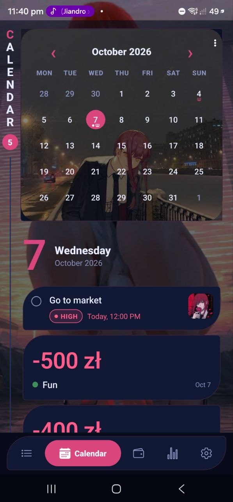
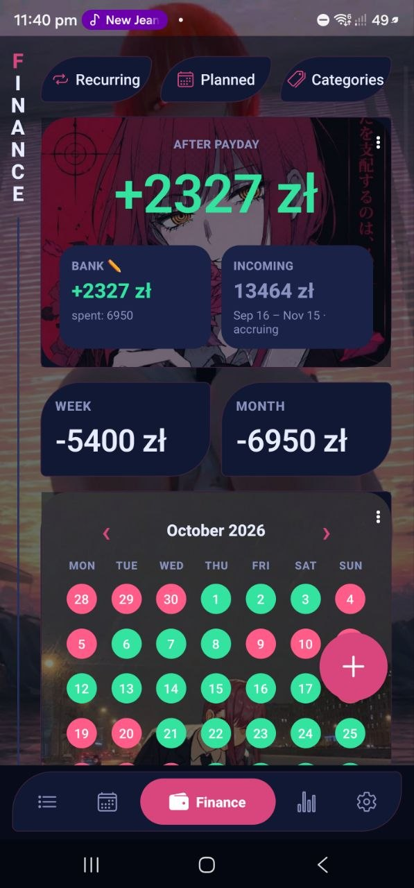
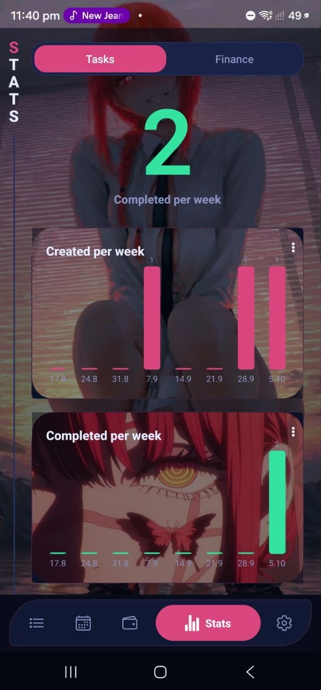
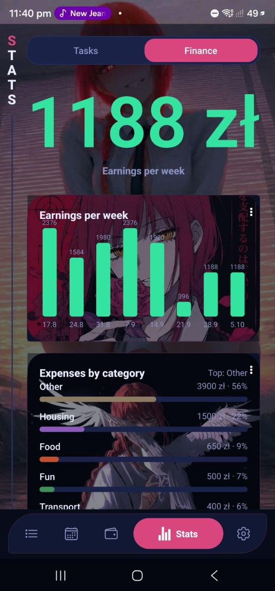
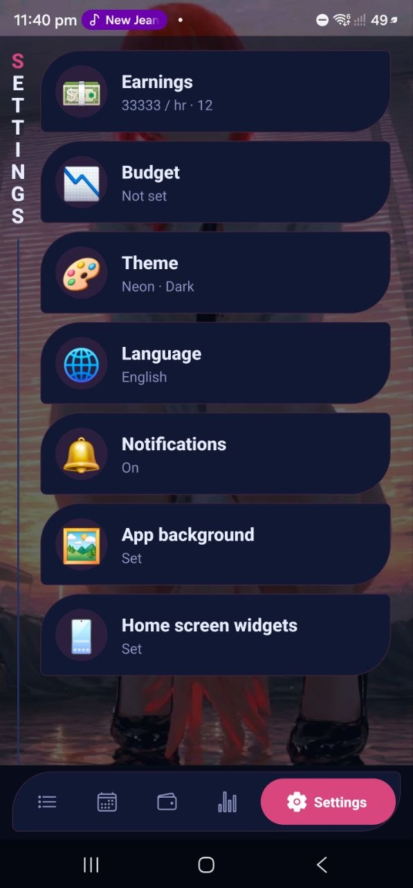
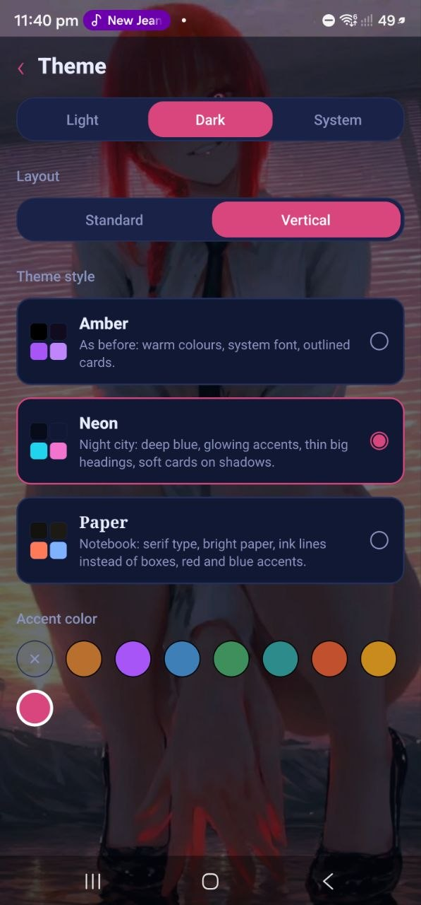

# Amber Ledger

Offline todo-organizer with an earnings/expense tracker, built with React Native + Expo
(TypeScript). No backend, no network calls — everything lives in a local SQLite database.

## Download (Android)

Grab **[Amber-Ledger.apk](https://github.com/sakurasso12/Amber-ledger/releases/latest/download/Amber-Ledger.apk)**
from the [latest release](https://github.com/sakurasso12/Amber-ledger/releases/latest), open it
on your phone and allow installing from this source when Android asks. Updates install over the
previous version and keep your data.

## Screenshots

Two layouts, switchable in **Settings → Theme → Layout**.

**Standard**

| Tasks | Calendar | Finance | Stats |
|:---:|:---:|:---:|:---:|
|  |  |  |  |

**Vertical**

| Tasks | Calendar | Finance | Stats |
|:---:|:---:|:---:|:---:|
|  |  |  |  |

| Stats · finance | Settings | Theme settings |
|:---:|:---:|:---:|
|  |  |  |

### What the Vertical layout adds

- Screen titles spelled down a rail on the left, with a live counter
- The nearest task as a big **In focus** card with a countdown and a Done button; the task's
  photo becomes the card's background, cropped to its leaf shape
- Big numbers: the selected day on Calendar, "after payday" on Finance, this week on Stats
- Leaf-shaped cards and a pill tab bar where the active tab expands to show its name
- Spring animations tuned to feel like iOS: the tab pill and segmented controls glide instead of
  jumping, cards and buttons sink slightly under your finger, screens slide in

## Customization

Almost everything about the look can be changed — everything except the font so far:

- **Light / dark / system** mode
- **Layout:** Standard or Vertical
- **Theme style:** Amber, Neon or Paper (colours, card shapes, tab bar)
- **Accent colour** on top of any style
- **App background:** your own picture behind every screen
- **Card backgrounds:** a picture per card (calendar, balance, charts…) via the ⋮ menu
- **Home screen widgets** with their own backgrounds
- **Language:** English, Russian, Ukrainian

## Stack

- **Expo (SDK 57) + TypeScript**, routing via `expo-router`
- **expo-sqlite** for storage (tasks, subtasks, tags, categories, expenses, work days, settings)
- **zustand** for state, with settings persisted straight into the SQLite `settings` table
- **expo-notifications** for deadline reminders and budget alerts; **@notifee/react-native** for
  the "important task" sticky/ongoing notification (a native module — see caveat below)
- Custom StyleSheet-based UI kit and a theme object/provider (`theme/`) — no third-party UI-kit
  library
- Custom calendar and bar-chart components on `react-native-svg` — no charting library

## Project layout

```
app/            expo-router routes (thin — each wires a screens/* component to a route)
screens/        actual screen implementations
components/     ui/, task/, finance/, calendar/, charts/
store/          zustand stores (useTaskStore, useFinanceStore, useSettingsStore)
db/             SQLite schema, client, and per-domain repositories
lib/            pure calculation/logic: earnings, expenses, recurrence, date ranges, task stats
notifications/  permission flow, reminder scheduler, budget alerts, sticky notification
theme/          theme objects (light/dark) + ThemeProvider
types/          shared TypeScript models
```

## Running in development

```sh
npm install
npx expo start
```

Opens in Expo Go or a dev client. **Sticky notifications for "important" tasks need a dev
client** — `@notifee/react-native` is a native module and does not work in plain Expo Go. Every
other feature (tasks, subtasks, recurrence, finance, calendar, stats, deadline/budget
notifications) works fine in Expo Go.

## Building a standalone APK

```sh
npx eas build --platform android --profile preview
```

This uses the `preview` profile in `eas.json`, which builds an installable `.apk` (not an
`.aab`), so it can be sideloaded directly — no dev server, no Expo Go, just tap the icon.

## License

MIT — see [LICENSE](LICENSE).
